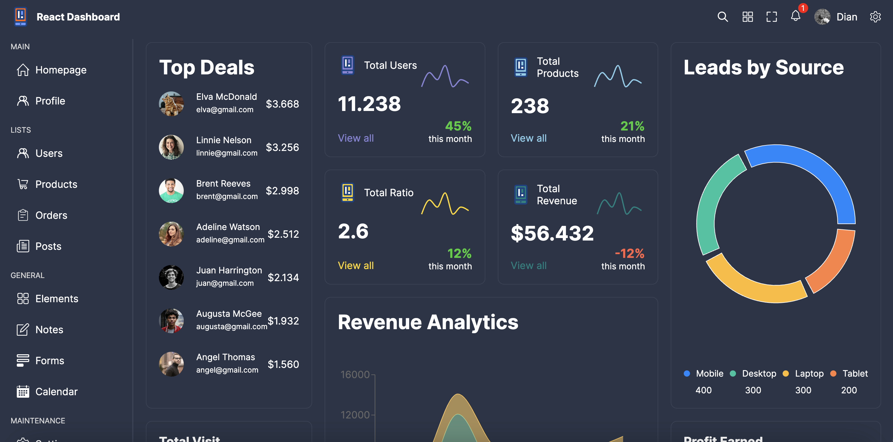

# React Dashboard Project

## Screenshot

## Table of Contents

- [Project Overview](#project-overview)
- [Features](#features)
- [Technologies Used](#technologies-used)
- [Installation](#installation)
- [Usage](#usage)
- [Contributing](#contributing)

## Project Overview

This project is a React Dashboard application created using TypeScript and SCSS, with Vite for project setup. The dashboard provides various visualizations on the home page using Recharts. It also includes additional pages for performing CRUD operations for users and products, with data stored in an array of objects.

## Features

- **Home Page**: Displays reports and visualizations using Recharts.
- **Users Page**: Perform CRUD operations (Create, Read, Update, Delete) on user data.
- **Products Page**: Perform CRUD operations (Create, Read, Update, Delete) on product data.
- **Responsive Design**: Optimized for various screen sizes.
- **MUI Grid**: Utilized for layout and styling.

## Technologies Used

- **React**: JavaScript library for building user interfaces.
- **TypeScript**: Typed superset of JavaScript that compiles to plain JavaScript.
- **SCSS**: Sassy CSS, a CSS preprocessor.
- **Vite**: Next generation frontend tooling for faster development.
- **Recharts**: A composable charting library built on React components.
- **MUI (Material-UI)**: React UI framework with a comprehensive set of components.

## Installation

1. Clone the repository:
   \`\`\`bash
   git clone https://github.com/your-username/react-dashboard.git
   cd react-dashboard
   \`\`\`

2. Install dependencies:
   \`\`\`bash
   npm install
   \`\`\`

## Usage

1. Start the development server:
   \`\`\`bash
   npm run dev
   \`\`\`

2. Open your browser and navigate to \`http://localhost:3000\` to view the dashboard.

## Contributing

Contributions are welcome! Please open an issue or submit a pull request for any improvements or suggestions.
